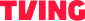

<p align="center">
  
</p>

<h1 align="center">TVING Tech Meetup</h1>

<p align="center">
  <strong>1,000만이 보는 그 화면을 만드는 사람들</strong><br/>
  한 달에 한 번, 우리가 부딪힌 문제를 가감 없이 공유합니다.
</p>

<p align="center">
  <a href="#"></a>
  <a href="#"></a>
  <a href="#"></a>
</p>

---

## About

**TVING Tech Meetup**은 No.1 K-콘텐츠 플랫폼 TVING의 월간 사내 기술 밋업입니다.

이번 테마는 **「스트리밍의 안쪽, 그 너머」** — 라이브 스트리밍 아키텍처부터 프론트엔드, ML 추천까지 다양한 기술 이야기를 나눕니다.

## Tech Stack

| Category | Stack |
|----------|-------|
| **Framework** | Next.js 15 (App Router) |
| **Language** | TypeScript |
| **Styling** | Tailwind CSS |
| **Animation** | Framer Motion |
| **Icons** | Lucide React |
| **Font** | Pretendard · JetBrains Mono |

## Features

- **Parallax Hero** — 스크롤 반응형 히어로 섹션 + 타이핑 텍스트 애니메이션
- **Live Countdown** — 밋업 D-day 실시간 카운트다운 타이머
- **Ticker Band** — 무한 스크롤 마키 텍스트
- **Cursor Glow** — 커서 따라다니는 글로우 이펙트
- **Scroll Reveal** — Intersection Observer 기반 등장 애니메이션
- **Tilt Cards** — 마우스 호버 3D 틸트 카드
- **CFP Form** — 발표 제안(Call for Proposals) 신청 섹션

## Sessions

| Time | Track | Title |
|------|-------|-------|
| 15:00 | MAIN | 팀 소개 — Web Core Development |
| 15:10 | ALL | 신규 입사자 소개 |
| 15:15 | INFRA | 장애 리포트 |
| 15:30 | WEB | Tech spec / RFC |
| 15:40 | WEB | 기술 공유 — Refine 실제 서비스 사례 공유 |
| 16:00 | ALL | Tech Pulse |
| 16:15 | ALL | What's Next & Closing |

## Getting Started

```bash
# 의존성 설치
npm install

# 개발 서버 실행
npm run dev

# 프로덕션 빌드
npm run build

# 프로덕션 서버 실행
npm run start
```

`http://localhost:3000`에서 확인할 수 있습니다.

## Project Structure

```
tving-tech-meetup/
├── app/
│   ├── layout.tsx          # 루트 레이아웃
│   ├── page.tsx            # 메인 페이지
│   └── globals.css         # 글로벌 스타일
├── components/
│   ├── HeroSection.tsx     # 히어로 (패럴랙스 + 카운트다운)
│   ├── AboutSection.tsx    # 밋업 소개
│   ├── ScheduleSection.tsx # 세션 타임테이블
│   ├── SpeakersSection.tsx # 발표자 카드
│   ├── CfpSection.tsx      # 발표 제안 폼
│   ├── GuidelinesSection.tsx
│   ├── Header.tsx          # 네비게이션
│   ├── Footer.tsx
│   └── ...                 # 유틸리티 컴포넌트
├── data/
│   └── meetup-data.ts      # 밋업 데이터 (스케줄, 발표자, 트랙)
├── hooks/
│   └── index.ts            # 커스텀 훅 (카운트다운 등)
└── public/
    ├── speakers/           # 발표자 일러스트
    └── logo-tving-red.svg  # TVING 로고
```

## Design

| Token | Value | Usage |
|-------|-------|-------|
| `--lime` | `#C6F73B` | Primary accent |
| `--bg-0` | `#0B0B0B` | Base background |
| `--fg-1` | `#FFFFFF` | Primary text |
| `--fg-3` | `#A0A0A0` | Muted text |

다크 톤 기반의 시네마틱 디자인 시스템으로, TVING 브랜드의 라임 그린을 액센트 컬러로 활용합니다.

---

<p align="center">
  <sub>Made with ♥ by <strong>TVING Engineering</strong></sub>
</p>
